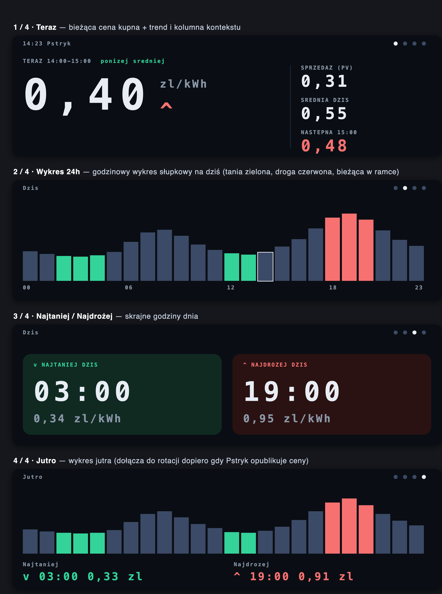
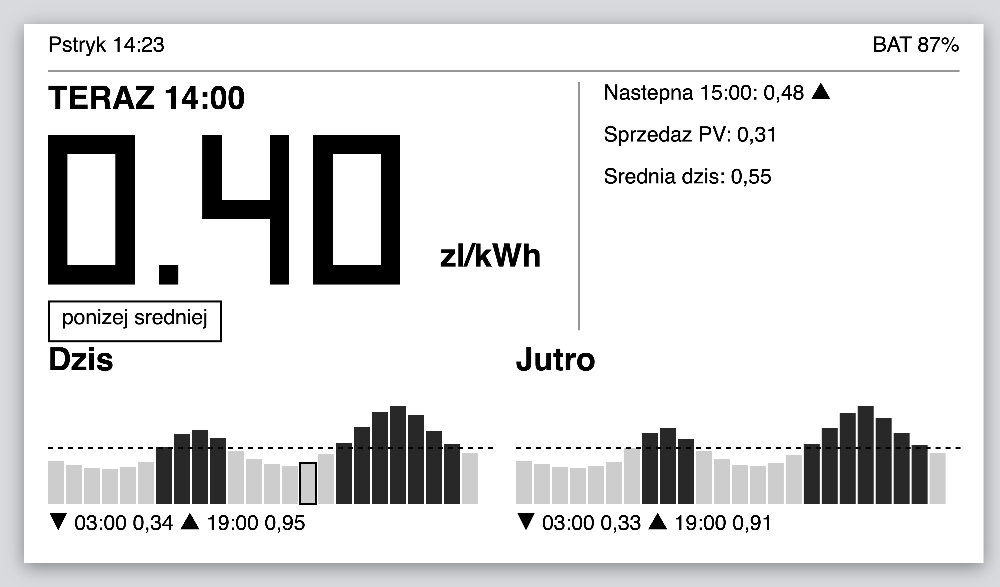

# Pstryk — wyświetlacz cen energii (ESP32)

Firmware dla ESP32-S3, który pokazuje **dynamiczne ceny energii elektrycznej z
[Pstryk](https://pstryk.pl)** na małym module na biurko lub ścianę. Urządzenie
łączy się z Wi-Fi, pobiera godzinowe ceny z API Pstryk i wyświetla je w czytelny,
„rzucasz okiem i wiesz" sposób — bez żadnej interakcji.

Ten sam, niezależny od płytki rdzeń logiki obsługuje **dwie różne płytki**, a
każda ma własną, cienką warstwę renderowania:

| Płytka | Ekran | Zasilanie | Tryb pracy |
| --- | --- | --- | --- |
| **LilyGo T-Display-S3-Long** | 3,4" LCD 640×180 (pasek poziomy), kolor | USB / sieć (always-on) | strony rotujące się automatycznie |
| **LilyGo T5 4.7" e-paper S3** | 4,7" e-ink 960×540, 16 odcieni szarości | bateria Li-ion | jeden ekran, budzenie co godzinę z deep-sleep |

---

## Więcej o projekcie

Szczegóły projektu — historię powstania urządzenia oraz pierwszy wydruk 3D
obudowy — można też przeczytać na blogu:

- [Rzucasz okiem i wiesz, kiedy prąd jest tani — oto moja domowa „pogodynka cenowa" do Pstryka](https://kobieceinspiracje.pl/186155,rzucasz-okiem-i-wiesz-kiedy-prad-jest-tani-oto-moja-domowa-pogodynka-cenowa-do-pstryka.html)
- [„Pogodynka cenowa" ma już obudowę — pierwszy wydruk 3D z białego PLA](https://kobieceinspiracje.pl/186216,pogodynka-cenowa-ma-juz-obudowe-pierwszy-wydruk-3d-z-bialego-pla.html)

---

## Jak wygląda ekran

> Poniższe obrazy to **wizualizacje wygenerowane z kodu układu ekranu**
> (`src/render/`), a nie fotografie urządzenia — odwzorowują rzeczywiste pozycje,
> kolory, czcionki i przykładowe dane. Źródła wizualizacji: [`docs/mockups/`](docs/mockups).

### LilyGo T-Display-S3-Long — 4 strony rotujące się co ~7 s

Bieżąca strona odświeża się co ~1 s (zegar/aktualna godzina), bez zapytań sieciowych.



### LilyGo T5 4.7" e-paper — jeden statyczny ekran

Wszystko, co pokazuje aplikacja Pstryk dla „dziś" i „jutro", zmieszczone na jednym
ekranie 960×540. Panel jest bistabilny — trzyma obraz „za darmo" podczas deep-sleep.



**Co widać na ekranach:**

- **Teraz** — duża bieżąca cena kupna (`price_gross`, brutto z VAT) + strzałka trendu
  na następną godzinę i tag `poniżej / powyżej średniej`.
- **Kolumna kontekstu** — `Sprzedaż (PV)` (`price_prosumer_gross`), `Średnia dziś`,
  `Następna HH:00`.
- **Wykres 24h** — godzinowy wykres słupkowy; tanie godziny na zielono (LCD) lub
  jasno (e-paper), drogie na czerwono / ciemno, bieżąca godzina w ramce, linia
  średniej dziennej (e-paper).
- **Najtaniej / Najdrożej** — skrajne godziny dnia.
- **Jutro** — wykres jutra; **dołącza dopiero gdy Pstryk opublikuje ceny** (zwykle
  ~12:00, czasem później), wcześniej jest pomijany / oznaczony „brak danych jeszcze".

> Uwaga: etykiety są celowo bez polskich znaków (`zl`, `ponizej`, `SREDNIA`) na
> płytce LCD, bo wbudowana czcionka bitmapowa nie zawiera diakrytyków.

---

## Funkcje

- 🔌 Pobieranie godzinowych cen z **API Pstryk** (endpoint `unified-metrics`).
- 🕒 Strefa **Europe/Warsaw** z obsługą czasu letniego/zimowego (POSIX TZ), synchronizacja NTP.
- 📊 Logika cen liczona po stronie urządzenia: cena bieżąca, najtańsza/najdroższa
  godzina, średnia dzienna, trend następnej godziny, wykrycie czy „jutro" już jest.
- 📶 **Konfiguracja przez captive portal** (WiFiManager) — Wi-Fi + klucz API w formularzu WWW.
- ⏱️ **Strategia odświeżania bezpieczna dla limitu** API (3 zapytania/godzinę).
- 🔋 e-paper: pomiar baterii, RTC PCF8563, deep-sleep dla wielomiesięcznej pracy.
- 🧩 **Czysty podział rdzeń ↔ renderowanie** — nową płytkę dodaje się pisząc tylko nowy renderer.

---

## Architektura

Firmware dzieli się na **niezależny od płytki rdzeń** i **cienką, zależną od płytki
warstwę renderowania**. Dzięki temu obie płytki współdzielą całą logikę.

```
                 ┌──────────── rdzeń (niezależny od płytki, współdzielony) ────────────┐
  API Pstryk  →  PstrykClient (transport + czysty parse) → PriceData → PriceLogic → PriceView
                 TimeService (UTC→Warsaw, DST)   Settings (NVS)   WiFiProvisioner   RefreshPolicy
                 └─────────────────────────────────────────────────────────────────────┘
                                              │ PriceView (gotowa do wyświetlenia struktura)
                                              ▼
   warstwa renderowania (zależna od płytki — jedyna część pisana per płytka):
       IRenderer  ◄── LongRenderer (Arduino_GFX, LCD QSPI)  +  Pages (4 strony)
                  ◄── EpdRenderer (epdiy, framebuffer szarości)  +  EpdDashboard (1 ekran)
   orkiestracja:
       App        — pętla always-on, rotacja stron, harmonogram odświeżania (LCD)
       SleepCycle — jeden cykl wake→fetch→paint→deep-sleep (e-paper)
```

- **`PriceView`** to szew między rdzeniem a renderowaniem: logika nigdy nie dotyka
  pikseli, renderowanie nigdy nie dotyka API.
- `main.cpp` wybiera `App` (LCD) lub `SleepCycle` (e-paper) na podstawie makra
  `-DPSTRYK_BOARD_EPAPER`, a `build_src_filter` w `platformio.ini` kompiluje tylko
  warstwę renderowania właściwą dla danej płytki.

Szczegóły projektowe: [`docs/superpowers/specs/`](docs/superpowers/specs).

---

## Struktura projektu

```
platformio.ini              3 środowiska: tdisplay_long, t5_epaper_s3, native
board/                      definicje płytek LilyGo (PSRAM/flash/USB)
lib/EPD47/                  wbudowany sterownik e-paper LilyGo (epdiy), GPLv3
src/
  main.cpp                  setup/loop → App lub SleepCycle (wg makra płytki)
  core/                     rdzeń: PstrykClient, PstrykParse, PriceLogic,
                            TimeService, RefreshPolicy, Settings, Battery, Format
  net/                      PstrykClient (transport), WiFiProvisioner
  view/PriceView.h          struktura gotowa do wyświetlenia (szew rdzeń↔render)
  render/
    IRenderer.h             abstrakcja renderera
    LongRenderer.*, Pages.* płytka LCD (Arduino_GFX)
    EpdRenderer.*, EpdDashboard.*  płytka e-paper (epdiy)
    pins_config.h
  app/
    App.*                   orkiestracja LCD (always-on)
    SleepCycle.*            orkiestracja e-paper (deep-sleep) + PCF8563 + bateria
test/                       testy jednostkowe (Unity) uruchamiane na hoście (env: native)
docs/                       specyfikacje, plany, makiety i zrzuty ekranu
```

---

## Wymagania

- [PlatformIO](https://platformio.org/) (CLI lub rozszerzenie do VS Code).
- Jedna z płytek: **LilyGo T-Display-S3-Long** lub **LilyGo T5 4.7" e-paper S3**
  (wariant zwykły, *nie* Pro).
- Konto i **klucz API Pstryk** (patrz niżej).
- Kabel USB-C.

Zależności (instalowane automatycznie przez PlatformIO z `platformio.ini`):
`ArduinoJson`, `WiFiManager`, oraz dla LCD `GFX Library for Arduino`. Sterownik
e-paper jest wbudowany w `lib/EPD47/`.

---

## Klucz API Pstryk

Klucz wygenerujesz w aplikacji/serwisie Pstryk:

> **Konto → „Urządzenia i integracje" → wygeneruj klucz** (pokazywany jednorazowo).

Klucz **nie** jest wpisywany do kodu — podajesz go w formularzu captive portal przy
pierwszym uruchomieniu (zapisuje się w pamięci NVS). Limit API: **3 zapytania na
godzinę** na endpoint, tylko do użytku osobistego/niekomercyjnego.

---

## Budowanie i wgrywanie

Projekt ma trzy środowiska PlatformIO. Wybierasz je flagą `-e`:

```bash
# Płytka LCD — LilyGo T-Display-S3-Long
pio run -e tdisplay_long --target upload
pio device monitor -e tdisplay_long      # podgląd logów (115200 baud)

# Płytka e-paper — LilyGo T5 4.7" S3
pio run -e t5_epaper_s3 --target upload
pio device monitor -e t5_epaper_s3
```

> **Tryb wgrywania (native USB):** jeśli płytka nie wchodzi w bootloader sama,
> przytrzymaj **BOOT**, naciśnij **RST**, puść BOOT — potem `upload`.

---

## Pierwsze uruchomienie (konfiguracja Wi-Fi + klucz)

1. Po pierwszym starcie (lub gdy brak zapisanej konfiguracji) urządzenie tworzy
   sieć Wi-Fi **`Pstryk-Setup`**.
2. Połącz się z nią telefonem/laptopem — otworzy się **captive portal**.
3. Wpisz **SSID i hasło Wi-Fi** oraz **klucz API Pstryk** i zapisz.
4. Urządzenie restartuje się, łączy z Wi-Fi, synchronizuje czas (NTP) i pobiera ceny.

Aby zmienić konfigurację później:

- **LCD:** przytrzymaj przycisk **BOOT** — ponownie otworzy captive portal.
- **e-paper:** przytrzymaj **przycisk użytkownika (GPIO 21) ≥ 3 s** przy starcie/wybudzeniu.

---

## Aktualizacje OTA (over-the-air)

Po wgraniu pierwszej wersji przez USB urządzenia same pobierają kolejne
aktualizacje z GitHub Releases — cicho, w tle, z weryfikacją podpisu i
automatycznym wycofaniem (rollback) wadliwego obrazu.

- **Płyta e-paper (T5):** sprawdza aktualizacje maksymalnie raz na dobę, przy
  okazji udanego cyklu pobierania cen.
- **Płyta AMOLED (T-Display-Long):** sprawdza co ok. 6 godzin.
- Wersja firmware jest widoczna w rogu ekranu (`vX.Y.Z`); `v0.0.0-dev` oznacza
  lokalny build, który **nie** aktualizuje się sam.

### Czysta płytka — obraz instalatora (bootstrap)

Żeby postawić **czystą płytkę** od zera bez ręcznego wstrzykiwania wersji, wgraj
jednorazowo obraz instalatora. Przy pierwszym starcie poprosi o Wi-Fi i klucz API
(captive portal `Pstryk-Setup`), a potem sam pobierze, zweryfikuje podpis i
zainstaluje **najnowszy** release dla swojej płyty — po czym zrestartuje się już w
docelowym, wersjonowanym firmwarze (i dalej łapie OTA normalnie):

```bash
pio run -e t5_epaper_s3_bootstrap  -t upload   # e-paper
pio run -e tdisplay_long_bootstrap -t upload   # AMOLED
```

Instalator pomija bramkę wersji (instaluje najnowsze niezależnie od tego, co ma na
pokładzie), ale **dalej weryfikuje podpis i zgodność płyty** — nie wgra
niepodpisanego ani cudzego obrazu. Zwykłe lokalne buildy (`-e t5_epaper_s3`)
pozostają chronione: jako `0.0.0-dev` nie aktualizują się same.

### Jednorazowa migracja płyty AMOLED

Starsze buildy AMOLED używały układu partycji `huge_app.csv` z **jedną** partycją
aplikacji — OTA jest tam niemożliwe. Aby włączyć OTA, wgraj **raz, przez USB**,
nową wersję (która używa `default_16MB.csv`). Od tego momentu kolejne
aktualizacje pójdą już przez OTA. Płyta e-paper nie wymaga tego kroku.

### Wydawanie nowej wersji (dla maintainera)

1. Otaguj commit sem-ver tagiem, np. `git tag v1.4.0 && git push origin v1.4.0`.
2. CI (`.github/workflows/release.yml`) zbuduje obie płyty, podpisze binaria
   kluczem prywatnym z sekretu `OTA_SIGNING_KEY` i opublikuje release z plikami
   `firmware-<board>.bin` oraz `manifest-<board>.json`.
3. Urządzenia pobiorą `…/releases/latest/download/manifest-<board>.json` i
   zaktualizują się, jeśli wersja w manifeście jest nowsza.

### Klucz podpisu

Obrazy są podpisywane RSA-3072/SHA-256. Klucz **publiczny** jest wkompilowany w
firmware (`src/net/ota_public_key.h`). Klucz **prywatny** istnieje wyłącznie w
sekrecie `OTA_SIGNING_KEY` i offline. Utrata klucza = brak możliwości wydawania
aktualizacji; wyciek = ktoś może podpisać firmware, które urządzenia zaakceptują.

---

## Strategia odświeżania (bezpieczna dla limitu API)

Jedno zapytanie na odświeżenie pobiera okno **dziś 00:00 → +48 h** (od razu łapie
„jutro", gdy tylko zostanie opublikowane). Limit 3 zapytania/godzinę nigdy nie jest
przekraczany:

- **LCD (always-on):** co **30 min**; w trybie „oczekiwania na jutro" (od 12:00,
  dopóki nie ma jutra) co **20 min** (= dokładnie 3/h).
- **e-paper (deep-sleep):** budzenie do **najbliższej pełnej godziny**; w oknie
  12:00–16:00 bez jutra — co ~30 min, by szybciej złapać jutrzejsze ceny.
- Zawsze respektowany jest nagłówek `429 Retry-After`.

---

## Źródło danych — API Pstryk

- **Endpoint:** `GET https://api.pstryk.pl/integrations/meter-data/unified-metrics/`
  `?metrics=pricing&resolution=hour&window_start=<UTC ISO>&window_end=<UTC ISO>`
- **Autoryzacja:** nagłówek `Authorization: sk-<klucz>` (surowy klucz, **bez**
  prefiksu `Bearer`; fallback na `Bearer` przy 401/403).
- **Okna w UTC** — urządzenie samo konwertuje na `Europe/Warsaw`.
- **Odpowiedź:** `{ "frames": [...], "summary": {...} }`; ceny są zagnieżdżone pod
  `frames[].metrics.pricing.*` (`price_gross` — kupno, `price_prosumer_gross` —
  sprzedaż, `is_cheap`, `is_expensive`). Bieżąca godzina liczona jest z zegara.
- **Jednostki:** PLN/kWh (np. `0.52` → wyświetlane `0,52 zł/kWh`).

---

## Testy

Czysty rdzeń (parser, logika cen, czas/DST, polityka odświeżania, bateria,
formatowanie) testowany jest **na hoście**, bez sprzętu, środowiskiem `native`
(framework Unity):

```bash
pio test -e native
```

Testy znajdują się w [`test/`](test) (m.in. `test_parse`, `test_logic`,
`test_time`, `test_refresh`, `test_battery`, `test_format`).

---

## Bezpieczeństwo

- HTTPS przez `WiFiClientSecure`; w wersji v1 domyślnie `setInsecure()` (pominięta
  weryfikacja certyfikatu) — akceptowalne dla urządzenia osobistego w sieci domowej.
  Pinowanie certyfikatu CA to udokumentowana opcja na przyszłość.
- Klucz API trzymany w NVS, nigdy nie logowany w całości.

---

## Licencja i źródła

- Projekt jest udostępniony na licencji **GNU AGPL v3.0** — patrz [`LICENSE`](LICENSE).
- Wbudowany sterownik e-paper w [`lib/EPD47/`](lib/EPD47) pochodzi od LilyGo
  (oparty na [epdiy](https://github.com/vroland/epdiy)) i jest na licencji
  **GPLv3** — patrz [`lib/EPD47/LICENSE`](lib/EPD47/LICENSE).
- Repozytoria płytek:
  [T-Display-S3-Long](https://github.com/Xinyuan-LilyGO/T-Display-S3-Long) ·
  [LilyGo-EPD47](https://github.com/Xinyuan-LilyGO/LilyGo-EPD47/tree/esp32s3).
- API Pstryk: [Swagger](https://api.pstryk.pl/integrations/swagger/) ·
  [Regulamin API](https://pstryk.pl/regulamin-api).
- Projekt jest niezwiązany z firmą Pstryk; korzysta z jej publicznego API do użytku osobistego.
